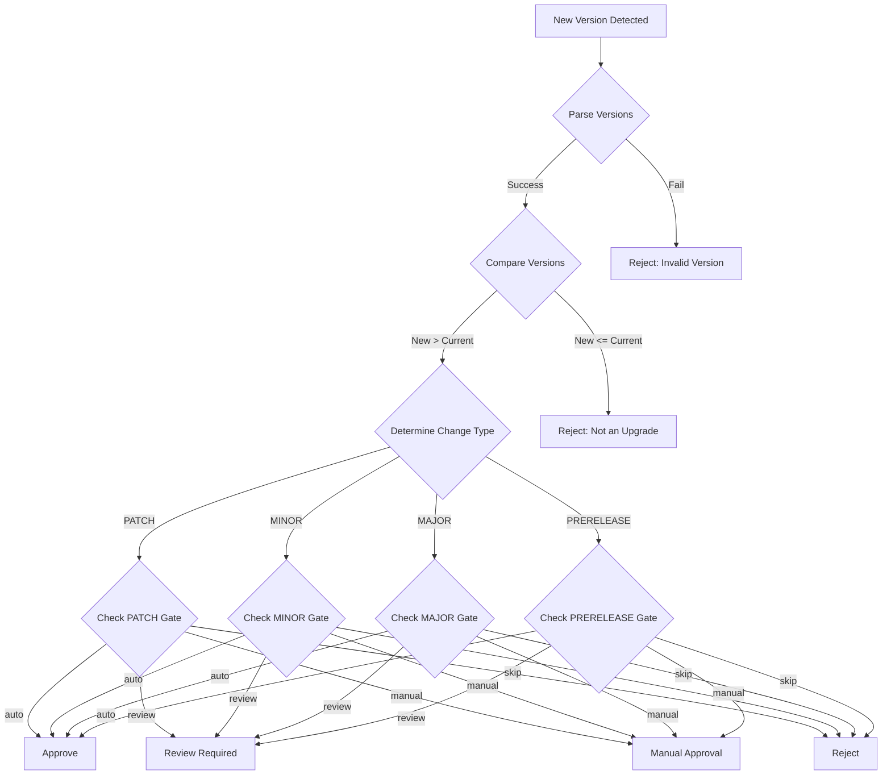

# Architecture Documentation
## Safe Auto-Updater System

**Version:** 1.0  
**Last Updated:** October 20, 2025

---

## Table of Contents
1. [System Overview](#1-system-overview)
2. [Architecture Principles](#2-architecture-principles)
3. [Component Architecture](#3-component-architecture)
4. [Data Flow](#4-data-flow)
5. [Decision Logic](#5-decision-logic)
6. [State Management](#6-state-management)
7. [Integration Patterns](#7-integration-patterns)
8. [Scalability & Performance](#8-scalability--performance)
9. [Error Handling](#9-error-handling)
10. [Future Architecture](#10-future-architecture)

---

## 1. System Overview

### 1.1 High-Level Architecture

```
┌──────────────────────────────────────────────────────────────────┐
│                    Safe Auto-Updater System                       │
├──────────────────────────────────────────────────────────────────┤
│                                                                    │
│  ┌─────────────┐  ┌──────────────┐  ┌──────────────────┐        │
│  │  Discovery  │  │  Analysis    │  │  Policy Engine   │        │
│  │  Layer      │→│  Layer       │→│  (Diff Gates)    │        │
│  └─────────────┘  └──────────────┘  └──────────────────┘        │
│         │                 │                    │                  │
│         ↓                 ↓                    ↓                  │
│  ┌─────────────────────────────────────────────────────┐        │
│  │           State Management (Inventory)              │        │
│  └─────────────────────────────────────────────────────┘        │
│                          ↓                                        │
│  ┌──────────────┐  ┌──────────────┐  ┌──────────────┐          │
│  │ Update       │  │ Health Check │  │ Rollback     │          │
│  │ Executor     │→│ System       │→│ Manager      │          │
│  └──────────────┘  └──────────────┘  └──────────────┘          │
│                                                                    │
├──────────────────────────────────────────────────────────────────┤
│                    External Integrations                          │
│                                                                    │
│  [Docker API]  [Kubernetes API]  [Helm]  [Registries]            │
└──────────────────────────────────────────────────────────────────┘
```

### 1.2 Component Layers

| Layer | Components | Responsibility |
|-------|------------|----------------|
| **Discovery** | Docker Scanner, K8s Scanner | Asset enumeration and metadata extraction |
| **Analysis** | SemVer Analyzer, Change Detector | Version comparison and change classification |
| **Policy** | Diff Gate, Policy Loader | Decision-making based on configured rules |
| **State** | State Manager | Persistence, queries, inventory management |
| **Execution** | Update Executor, Health Checker | Apply updates and validate health |
| **Recovery** | Rollback Manager | Automatic recovery from failures |

---

## 2. Architecture Principles

### 2.1 Design Principles

#### Separation of Concerns
```
Discovery ≠ Analysis ≠ Decision ≠ Execution

Each component has a single, well-defined responsibility:
- Scanners: Discover assets
- Analyzers: Compare versions
- Gates: Make decisions
- Executors: Apply changes
```

#### Fail-Safe by Default
```python
# Always default to safe behavior
class DiffGate:
    def evaluate_update(self, current: str, new: str) -> dict:
        try:
            comparison, change_type = self.analyzer.compare_versions(current, new)
        except Exception as e:
            # On error, block the update
            return {
                'decision': 'reject',
                'safe': False,
                'reason': f'Version analysis failed: {e}'
            }
```

#### Observable & Auditable
```python
# Log all significant decisions
logger.info(
    "update_decision",
    asset="my-app",
    decision="approve",
    reason="patch_update_auto_approved",
    change_type="patch",
    policy_applied="semver_gates.patch=auto"
)
```

#### Policy-Driven
```yaml
# Behavior controlled by declarative policies
semver_gates:
  patch: auto      # Codified in policy, not code
  minor: review
  major: manual
```

### 2.2 Architectural Patterns

| Pattern | Usage | Rationale |
|---------|-------|-----------|
| **Strategy Pattern** | SemVer gates (auto/review/manual/skip) | Flexible update policies |
| **Factory Pattern** | Health check creation by type | Extensible health checks |
| **Observer Pattern** | Event logging and metrics | Decoupled monitoring |
| **Command Pattern** | Update/rollback operations | Undoable actions |
| **State Pattern** | Asset lifecycle management | Clear state transitions |

---

## 3. Component Architecture

### 3.1 Discovery Layer

#### Docker Scanner

```
┌────────────────────────────────┐
│     DockerScanner              │
├────────────────────────────────┤
│ + scan_containers()            │
│ + get_container_metadata()     │
│ + extract_image_info()         │
│ + track_labels()               │
└────────────────────────────────┘
         │
         │ uses
         ↓
┌────────────────────────────────┐
│    Docker API Client           │
│  (docker-py)                   │
└────────────────────────────────┘
         │
         │ connects to
         ↓
┌────────────────────────────────┐
│   Docker Daemon                │
│   (/var/run/docker.sock)       │
└────────────────────────────────┘
```

**Responsibilities**:
- Connect to Docker daemon (socket or TCP)
- Enumerate containers (running/stopped)
- Extract image tags, digests, labels
- Map containers to images

**Key Methods**:
```python
class DockerScanner:
    def scan_containers(
        self,
        include_stopped: bool = False
    ) -> List[Dict[str, Any]]:
        """Discover and return container information."""
        
    def get_image_digest(self, image_name: str) -> Optional[str]:
        """Retrieve immutable digest for image."""
```

#### Kubernetes Scanner

```
┌────────────────────────────────┐
│    KubernetesScanner           │
├────────────────────────────────┤
│ + scan_deployments()           │
│ + scan_statefulsets()          │
│ + scan_daemonsets()            │
│ + scan_crds()                  │
│ + extract_helm_metadata()      │
└────────────────────────────────┘
         │
         │ uses
         ↓
┌────────────────────────────────┐
│  Kubernetes Python Client      │
│  (kubernetes.client)           │
└────────────────────────────────┘
         │
         │ authenticates
         ↓
┌────────────────────────────────┐
│   Kubernetes API Server        │
│   (in-cluster or kubeconfig)   │
└────────────────────────────────┘
```

**Responsibilities**:
- Authenticate to Kubernetes API
- Enumerate workload resources
- Extract pod specifications
- Identify Helm releases
- Track CRD versions

**Key Methods**:
```python
class KubernetesScanner:
    def scan_all_resources(
        self,
        namespace: Optional[str] = None
    ) -> List[Asset]:
        """Scan all supported Kubernetes resources."""
        
    def get_helm_releases(self, namespace: str) -> List[HelmRelease]:
        """Discover Helm releases in namespace."""
```

### 3.2 Analysis Layer

#### SemVer Analyzer

```
┌────────────────────────────────┐
│    SemVerAnalyzer              │
├────────────────────────────────┤
│ + parse_version()              │
│ + compare_versions()           │
│ + is_upgrade()                 │
│ + is_breaking_change()         │
│ + determine_change_type()      │
└────────────────────────────────┘
         │
         │ uses
         ↓
┌────────────────────────────────┐
│     semver library             │
│  (python-semver)               │
└────────────────────────────────┘
```

**Version Parsing Pipeline**:

```
Input: "v1.2.3-beta.1+build.456"
  ↓
┌─────────────────────┐
│  Strip prefix (v)   │
└─────────────────────┘
  ↓
┌─────────────────────┐
│  Parse components   │
│  Major: 1           │
│  Minor: 2           │
│  Patch: 3           │
│  Prerelease: beta.1 │
│  Build: build.456   │
└─────────────────────┘
  ↓
┌─────────────────────┐
│  Create semver.     │
│  Version object     │
└─────────────────────┘
```

**Comparison Logic**:

```python
def compare_versions(current: str, new: str) -> Tuple[int, VersionChangeType]:
    """
    Returns:
        (1, PATCH)  if new > current (patch bump)
        (1, MINOR)  if new > current (minor bump)
        (1, MAJOR)  if new > current (major bump)
        (0, NO_CHANGE) if equal
        (-1, UNKNOWN) if new < current
    """
```

### 3.3 Policy Engine

#### Diff Gate

```
┌────────────────────────────────────────┐
│           DiffGate                     │
├────────────────────────────────────────┤
│                                        │
│  evaluate_update(current, new)        │
│    ↓                                   │
│  ┌──────────────────────────┐         │
│  │ 1. Parse versions         │        │
│  └──────────────────────────┘         │
│    ↓                                   │
│  ┌──────────────────────────┐         │
│  │ 2. Determine change type  │        │
│  │    (MAJOR/MINOR/PATCH)    │        │
│  └──────────────────────────┘         │
│    ↓                                   │
│  ┌──────────────────────────┐         │
│  │ 3. Lookup policy rule     │        │
│  │    semver_gates[type]     │        │
│  └──────────────────────────┘         │
│    ↓                                   │
│  ┌──────────────────────────┐         │
│  │ 4. Apply rule             │        │
│  │    auto/review/manual/skip│        │
│  └──────────────────────────┘         │
│    ↓                                   │
│  ┌──────────────────────────┐         │
│  │ 5. Return decision        │        │
│  └──────────────────────────┘         │
│                                        │
└────────────────────────────────────────┘
```

**Decision Matrix**:

| Change Type | Gate Action | Decision | Safe | Auto-Update |
|-------------|-------------|----------|------|-------------|
| PATCH | auto | approve | ✅ | ✅ |
| PATCH | review | review_required | ❌ | ❌ |
| MINOR | auto | approve | ✅ | ✅ |
| MINOR | review | review_required | ❌ | ❌ |
| MINOR | manual | manual_approval | ❌ | ❌ |
| MAJOR | manual | manual_approval | ❌ | ❌ |
| MAJOR | skip | reject | ❌ | ❌ |

---

## 4. Data Flow

### 4.1 Discovery Flow

```
Start
  ↓
┌────────────────────┐
│ CLI: scan command  │
└────────────────────┘
  ↓
┌────────────────────────────────────┐
│ Config: Load policy.yaml           │
└────────────────────────────────────┘
  ↓
┌────────────────────────────────────┐
│ Docker Scanner: Connect to daemon  │
└────────────────────────────────────┘
  ↓
┌────────────────────────────────────┐
│ Docker Scanner: List containers    │
│   For each container:              │
│     - Extract ID, name, image      │
│     - Parse image tag/digest       │
│     - Read labels                  │
│     - Get creation time            │
└────────────────────────────────────┘
  ↓
┌────────────────────────────────────┐
│ K8s Scanner: Connect to API        │
└────────────────────────────────────┘
  ↓
┌────────────────────────────────────┐
│ K8s Scanner: List resources        │
│   For each resource:               │
│     - Extract name, namespace      │
│     - Get pod spec (images)        │
│     - Parse Helm annotations       │
│     - Track CRD versions           │
└────────────────────────────────────┘
  ↓
┌────────────────────────────────────┐
│ State Manager: Persist inventory   │
│   - Update existing assets         │
│   - Add new assets                 │
│   - Mark removed assets            │
│   - Generate statistics            │
└────────────────────────────────────┘
  ↓
┌────────────────────────────────────┐
│ Output: Display summary table      │
└────────────────────────────────────┘
  ↓
End
```

### 4.2 Update Decision Flow

```
New version detected
  ↓
┌─────────────────────────────────┐
│ SemVer Analyzer: Parse versions │
└─────────────────────────────────┘
  ↓
┌─────────────────────────────────┐
│ SemVer Analyzer: Compare        │
│   Result: (1, MINOR)            │
└─────────────────────────────────┘
  ↓
┌─────────────────────────────────┐
│ Diff Gate: Lookup policy        │
│   semver_gates.minor = review   │
└─────────────────────────────────┘
  ↓
┌─────────────────────────────────┐
│ Diff Gate: Evaluate             │
│   decision = review_required    │
│   safe = False                  │
│   reason = "Minor update..."    │
└─────────────────────────────────┘
  ↓
┌─────────────────────────────────┐
│ Logger: Audit decision          │
└─────────────────────────────────┘
  ↓
┌─────────────────────────────────┐
│ Metrics: Increment counters     │
│   updates_evaluated_total++     │
│   updates_blocked_total++       │
└─────────────────────────────────┘
  ↓
Return decision to caller
```

### 4.3 Update Execution Flow (Future)

```
Update approved
  ↓
┌─────────────────────────────────┐
│ Update Executor: Pre-flight     │
│   - Validate target exists      │
│   - Check update window         │
│   - Verify concurrency limit    │
└─────────────────────────────────┘
  ↓
┌─────────────────────────────────┐
│ Update Executor: Snapshot state │
│   - Record current version      │
│   - Store rollback info         │
└─────────────────────────────────┘
  ↓
┌─────────────────────────────────┐
│ Update Executor: Apply update   │
│   Docker: Pull new image        │
│   K8s: Update Deployment        │
│   Helm: helm upgrade            │
└─────────────────────────────────┘
  ↓
┌─────────────────────────────────┐
│ Health Checker: Wait for ready  │
│   - Monitor rollout status      │
│   - Check readiness probes      │
│   - Timeout: 5 minutes          │
└─────────────────────────────────┘
  ↓
  ├─→ Health OK ─→ Success
  │
  └─→ Health FAIL
        ↓
      ┌─────────────────────────┐
      │ Rollback Manager:       │
      │   - Revert to snapshot  │
      │   - Wait for stable     │
      │   - Log failure         │
      └─────────────────────────┘
        ↓
      Failure (rolled back)
```

---

## 5. Decision Logic

### 5.1 Update Approval Decision Tree



### 5.2 Health Check Logic

```
Update Applied
  ↓
┌──────────────────────────────┐
│ Start Monitoring Window      │
│ Duration: 300s (configurable)│
└──────────────────────────────┘
  ↓
┌──────────────────────────────┐
│ Every 10 seconds:            │
│  ┌────────────────────────┐  │
│  │ Check Health           │  │
│  ├────────────────────────┤  │
│  │ HTTP probe: /health    │  │
│  │ K8s: Pod readiness     │  │
│  │ TCP: Port 8080         │  │
│  └────────────────────────┘  │
│    ↓                         │
│  ┌────────────────────────┐  │
│  │ Calculate Failure Rate │  │
│  │   failed / total       │  │
│  └────────────────────────┘  │
│    ↓                         │
│  ┌────────────────────────┐  │
│  │ Compare to Threshold   │  │
│  │   rate > 0.1 (10%)?    │  │
│  └────────────────────────┘  │
└──────────────────────────────┘
  ↓
  ├─→ Failure Rate OK → Continue Monitoring
  │
  └─→ Failure Rate EXCEEDED
        ↓
      Trigger Rollback
```

---

## 6. State Management

### 6.1 Asset State Model

```python
class Asset:
    """Represents a tracked asset."""
    
    id: str                    # Unique identifier
    name: str                  # Human-readable name
    asset_type: AssetType      # deployment, container, etc.
    namespace: Optional[str]   # K8s namespace
    
    current_version: str       # Currently running version
    available_version: Optional[str]  # Latest available
    
    status: AssetStatus        # healthy, updating, failed
    last_scan: datetime        # Last discovery time
    last_update: Optional[datetime]  # Last update time
    
    metadata: Dict[str, Any]   # Type-specific metadata
    labels: Dict[str, str]     # User labels
    
    update_history: List[UpdateRecord]  # History of updates
```

### 6.2 State Persistence

```
┌──────────────────────────────────────┐
│        State Manager                 │
├──────────────────────────────────────┤
│                                      │
│  In-Memory State                    │
│  ┌────────────────────────────┐    │
│  │  assets: Dict[str, Asset]  │    │
│  └────────────────────────────┘    │
│              ↕                       │
│  ┌────────────────────────────┐    │
│  │  On-Disk Persistence       │    │
│  │  Format: JSON              │    │
│  │  Path: /app/data/state.json│    │
│  └────────────────────────────┘    │
│                                      │
└──────────────────────────────────────┘

# File format
{
  "version": "1.0",
  "last_updated": "2025-10-20T10:30:00Z",
  "assets": [
    {
      "id": "deployment-my-app-default",
      "name": "my-app",
      "asset_type": "deployment",
      "current_version": "1.2.3",
      ...
    }
  ],
  "statistics": {
    "total_assets": 45,
    "by_type": {...},
    "by_status": {...}
  }
}
```

---

## 7. Integration Patterns

### 7.1 Registry Integration

```
Safe Updater
     │
     │ HTTPS
     ↓
┌─────────────────────────┐
│  Container Registry     │
│  (Docker Hub, GCR,      │
│   GitHub Packages)      │
├─────────────────────────┤
│                         │
│  GET /v2/<image>/tags   │
│  GET /v2/<image>/       │
│      manifests/<tag>    │
│                         │
└─────────────────────────┘
```

**Authentication**:
- Basic Auth (username/password)
- Bearer Token
- Docker config.json

**Operations**:
- List tags
- Get manifest (digest)
- Pull image metadata

### 7.2 Kubernetes Integration

```
Safe Updater (ServiceAccount: safe-updater)
     │
     │ mTLS
     ↓
┌──────────────────────────────┐
│  Kubernetes API Server       │
├──────────────────────────────┤
│                              │
│  GET /apis/apps/v1/          │
│      deployments             │
│                              │
│  PATCH /apis/apps/v1/        │
│        namespaces/{ns}/      │
│        deployments/{name}    │
│                              │
└──────────────────────────────┘
```

**RBAC Requirements**:
- Read: pods, deployments, statefulsets, daemonsets
- Write (future): deployments, statefulsets
- Watch: pod status for health checks

---

## 8. Scalability & Performance

### 8.1 Performance Characteristics

| Operation | Time Complexity | Space Complexity | Notes |
|-----------|-----------------|------------------|-------|
| Scan 1000 assets | O(n) ~30s | O(n) ~150MB | Parallel API calls |
| Compare versions | O(1) <1ms | O(1) | Cached parsing |
| Evaluate policy | O(1) <1ms | O(1) | Direct lookup |
| State persistence | O(n) ~100ms | O(n) | JSON serialization |

### 8.2 Scaling Strategies

#### Horizontal Scaling (Future)
```
┌──────────────┐   ┌──────────────┐   ┌──────────────┐
│  Updater     │   │  Updater     │   │  Updater     │
│  Instance 1  │   │  Instance 2  │   │  Instance 3  │
└──────────────┘   └──────────────┘   └──────────────┘
       │                  │                  │
       └──────────────────┴──────────────────┘
                          │
                          ↓
                 ┌─────────────────┐
                 │ Leader Election │
                 │   (K8s Lease)   │
                 └─────────────────┘
```

#### Caching Strategy
```python
# Cache parsed versions
@lru_cache(maxsize=1000)
def parse_version(version_string: str) -> Optional[semver.Version]:
    """Cached version parsing."""
    pass

# Cache registry lookups (5 minutes)
@ttl_cache(maxsize=100, ttl=300)
def get_available_tags(image: str) -> List[str]:
    """Cached registry tag lookup."""
    pass
```

---

## 9. Error Handling

### 9.1 Error Categories

```python
# Base exception
class SafeUpdaterError(Exception):
    """Base exception for Safe Updater."""
    pass

# Configuration errors
class ConfigurationError(SafeUpdaterError):
    """Configuration validation error."""
    pass

# Scan errors
class ScanError(SafeUpdaterError):
    """Asset scanning error."""
    pass

class DockerConnectionError(ScanError):
    """Docker daemon connection failed."""
    pass

class KubernetesAuthError(ScanError):
    """Kubernetes authentication failed."""
    pass

# Update errors
class UpdateError(SafeUpdaterError):
    """Update operation failed."""
    pass

class HealthCheckError(UpdateError):
    """Health check failed."""
    pass

class RollbackError(SafeUpdaterError):
    """Rollback operation failed."""
    pass
```

### 9.2 Error Recovery

```
Error Detected
  ↓
┌──────────────────────────┐
│ Classify Error           │
│  - Transient?           │
│  - Permanent?           │
│  - Recoverable?         │
└──────────────────────────┘
  ↓
  ├─→ Transient (network) → Retry with backoff
  │
  ├─→ Permanent (auth) → Fail fast, alert
  │
  └─→ Recoverable (update) → Rollback
```

---

## 10. Future Architecture

### 10.1 Planned Enhancements

#### GitOps Integration
```
Safe Updater
     │
     │ creates PR
     ↓
┌──────────────────────────┐
│  Git Repository          │
│  (GitOps source)         │
└──────────────────────────┘
     │
     │ syncs
     ↓
┌──────────────────────────┐
│  ArgoCD / Flux           │
│  (GitOps operator)       │
└──────────────────────────┘
     │
     │ applies
     ↓
┌──────────────────────────┐
│  Kubernetes Cluster      │
└──────────────────────────┘
```

#### Multi-Cluster Support
```
┌────────────────────────────────────┐
│       Safe Updater (Central)       │
└────────────────────────────────────┘
         │
    ┌────┴────┬────────┬────────┐
    │         │        │        │
    ↓         ↓        ↓        ↓
┌────────┐┌────────┐┌────────┐┌────────┐
│Cluster ││Cluster ││Cluster ││Cluster │
│  Dev   ││ Stage  ││ Prod-1 ││ Prod-2 │
└────────┘└────────┘└────────┘└────────┘
```

#### Event-Driven Architecture
```
Registry Webhook
     │
     ↓
┌──────────────┐
│ Event Queue  │
│ (Kafka/NATS) │
└──────────────┘
     │
     ↓
Safe Updater
     │
     ↓
Update Pipeline
```

---

**Document Maintenance**:
- Review on major architectural changes
- Update diagrams with each release
- Validate against implementation

**Next Review**: 2026-01-20
